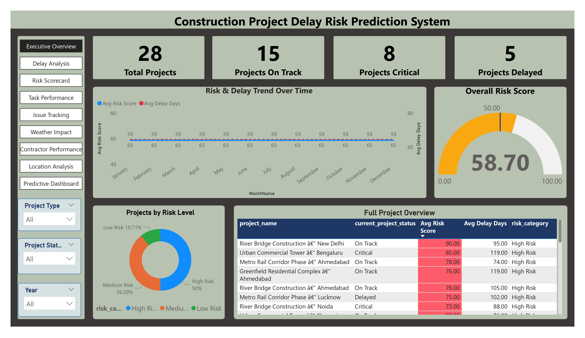

# 🏗️ Construction Project Delay Risk Prediction System

A data analytics system that predicts construction project delay risk using SQL-based data processing and Power BI visualization. Built as a capstone project.


---

## 📌 Overview

Construction projects frequently run late, and project managers often lack an early-warning system to flag high-risk projects before delays spiral out of control. This project builds a **risk scoring system** that analyzes historical project data — schedule slippage, blocked tasks, weather stoppages, and open issues — and classifies each project as **Low / Medium / High Risk**.

The system covers the full pipeline: raw CSV data → MySQL preprocessing → star-schema data model → Power BI dashboard with 9 pages and 43 DAX measures.

---

## Dashboard Preview


---

## 📊 Dataset

| File | Records | Description |
|---|---|---|
| `projects.csv` | 28 | Project master data (location, contractor, dates, value) |
| `tasks.csv` | 5,746 | Task list with category, duration, critical path flag |
| `task_progress_updates.csv` | 137,899 | Progress tracking records |
| `issues_ncr_rfi.csv` | 1,609 | Issues, NCRs, and RFIs |
| `task_dependencies.csv` | 8,619 | Task dependency relationships |
| `weather_log.csv` | 20,824 | Daily weather and work-stoppage records |

**Total: 174,525 records** across 28 construction projects.

---

## 🏛️ Architecture

```
CSV Files  →  MySQL (Star Schema)  →  Risk Score Calculation  →  Power BI  →  9-Page Dashboard
```

**Data Model (Star Schema):**

- **Dimension tables:** `DimProjects`, `DimTasks`, `DimDelayReasons`, `DimDate` (created in Power BI)
- **Fact tables:** `FactProjectMetrics` (central table), `FactTaskProgress`, `FactIssues`, `FactWeatherImpact`
- **Views:** `vw_ProjectRiskSummary`, `vw_ContractorPerformance`, `vw_LocationRisk`, `vw_CriticalPathRisk`

---

## 🎯 Risk Score Formula

The risk score (0–100) is a **variance-weighted composite** of four factors. Metrics were selected by analyzing which ones actually differ between projects — low-variance metrics (progress velocity, completion %) were dropped since they don't help distinguish risk.

| Component | Weight | Data Variance |
|---|---|---|
| Delay Days | 40% | 53.8% |
| Blocked Tasks % | 30% | 21.6% |
| Work Stop Days | 20% | 17.2% |
| Open Issues | 10% | 18.1% |

Thresholds are **percentile-based** (calculated from the actual data distribution, not fixed guesses).

**Risk Categories:**
- 🟢 Low Risk: 0–34
- 🟡 Medium Risk: 35–59
- 🔴 High Risk: 60–100

---

## 📈 Dashboard Pages

| # | Page | Purpose |
|---|---|---|
| 1 | Executive Overview | High-level KPIs, risk gauge, risk distribution |
| 2 | Delay Analysis | Root cause analysis, risk vs. delay correlation |
| 3 | Risk Scorecard | Full risk breakdown per project |
| 4 | Task Performance | Task completion & critical path tracking |
| 5 | Issue Tracking | NCR / RFI / Safety issue monitoring |
| 6 | Weather Impact | Weather-related delay analysis |
| 7 | Contractor Performance | Contractor comparison |
| 8 | Location Analysis | Geographic risk patterns |
| 9 | Predictive Dashboard | Early warning / at-risk project list |

---

## 🛠️ Tech Stack

- **Database:** MySQL 8.0
- **Data Processing:** SQL (MySQL Workbench)
- **Visualization:** Power BI Desktop
- **Measures:** DAX (43 measures)

---

### SQL preprocessing performed

- Imported 6 raw CSV files into MySQL
- Cleaned null values
- Standardized date formats
- Created star-schema tables
- Built fact and dimension tables
- Generated project-level risk metrics
- Created analytical views for Power BI

---

## Repository Structure
data/
├── raw/
├── cleaned/
sql/
├── data_preprocessing.sql
powerbi/
├── Construction_Risk_Dashboard.pbix
presentation/
├── project_presentation.pptx
screenshots/
LICENSE
README.md

---


🚀 How to Run This Project
Prerequisites
MySQL 8.0 (or MySQL Workbench)
Power BI Desktop
Step 1: Import the raw data

Import all CSV files from data/raw/ into MySQL using Table Data Import Wizard in MySQL Workbench.

Step 2: Run the SQL preprocessing script

Execute the SQL script located in the sql/ folder:

data_preprocessing.sql

This script cleans the raw data, creates the required fact and dimension tables, generates analytical views, and prepares the final dataset for Power BI.

Step 3: Open the Power BI dashboard
Open powerbi/Construction_Risk_Dashboard.pbix.
If Power BI prompts for a data source, reconnect it to your local MySQL database.
Click Refresh to load the processed data.
Step 4: Explore the dashboard

The dashboard includes project-level risk scores, delay analysis, contractor performance, weather impact, task performance, and an executive overview page for decision-makers.

---

## 🔑 Key Learnings

1. **Always analyze data variance before designing a scoring formula** — the first two formula versions failed because generic thresholds didn't match this dataset's actual distribution.
2. **Helper tables > nested CTEs** for readability and debugging in multi-step SQL transformations.
3. **Percentile-based thresholds** adapt to the dataset automatically, unlike fixed thresholds.
4. Pre-aggregating in SQL (`FactProjectMetrics`) keeps Power BI fast — no heavy calculations at query time.

---

## 🔮 Future Work

- Machine learning model (once more project history is available)
- Real-time dashboard refresh
- Predictive forecasting (30/60/90-day risk projection)
- Mobile dashboard for site engineers
- Automated alerts when risk score crosses threshold

---

## 📄 License

This project is licensed under the MIT License — see [`LICENSE`](LICENSE).

---

## 🙋 Author

**Syed Rehan**
[LinkedIn](https://www.linkedin.com/in/syedrhn0) · [Email](mailto:syedrhn0@gmail.com)

Capstone project — Imarticus Learning, 2026
